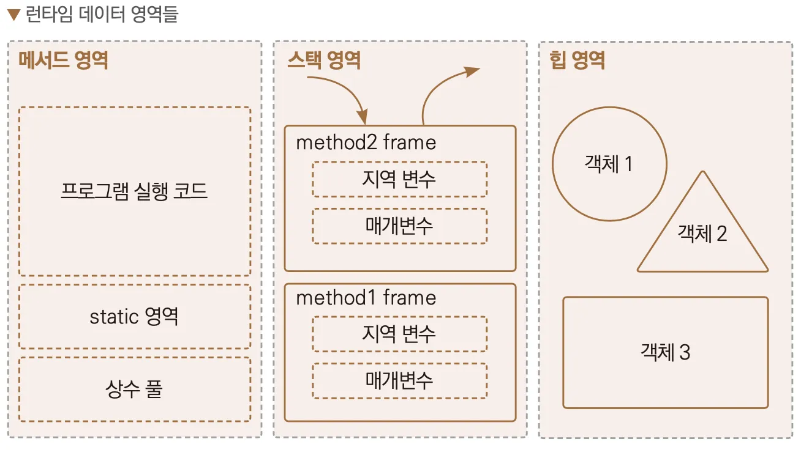

# 아이템 24. 멤버 클래스는 되도록 static으로 만들라

## 내부 클래스의 종류

- 중첩 클래스는 다른 클래스 안에 정의된 클래스를 말함
- 중첩 클래스는 자신을 감싼 바깥 클래스에서만 쓰여야하고, 그 외의 용도를 갖는다면 얘는 톱레벨 클래스로 만들어야함
- 중첩 클래스의 종류는 **정적 멤버 클래스, 비정적 멤버 클래스, 익명 클래스, 지역 클래스**가 있음
- 정적 멤버 클래스를 제외한 나머지는 내부 클래스임(inner class)

중첩 클래스를 언제, 왜 사용해야하는지 알아보시죵~!

## **정적 멤버 클래스에 대하여**

```java
public class OuterClass {
    private static String staticMessage = "Hello from static member!";
    private String noeStaticMessage = "Hi I'm None Static";
    
    // 정적 멤버 클래스 정의
    public static class StaticNestedClass {
        // 정적 멤버 클래스의 메서드
        public void printMessage() {
            // 외부 클래스의 정적 멤버에 접근 가능
            System.out.println(staticMessage);
            
            // 이건 에러남
            System.out.println(OuterClass.this.noeStaticMessage);
        }
    }

    public static void main(String[] args) {
        // 정적 멤버 클래스는 외부 클래스의 인스턴스 없이 생성 가능
        OuterClass.StaticNestedClass nestedObject = new OuterClass.StaticNestedClass();
        
        // 정적 멤버 클래스의 메서드 호출
        nestedObject.printMessage();
    }
}

```

- 다른 클래스 안에 선언되지만 바깥 클래스의 private 멤버에도 접근 가능하다.
- 그것 외에는 일반 클래스와 똑같다. (다른 정적 멤버와 똑같은 접근 규칙을 적용 받음)
- 정적 멤버 클래스는 바깥 클래스와 함께 쓰일때만 유용한 public 도우미 클래스로 쓰인다.

## 비정적 멤버 클래스와의 차이

- 비정적 멤버 클래스의 인스턴스는 바깥 클래스의 인스턴스와 암묵적으로 연결된다.
- 비정적 멤버 클래스는 바깥 클래스에 접근 가능하고(정규화된 this를 사용해) 정적 멤버 클래스는 바깥 클래스에 접근 불가능한 특징이 있다.

```java
public class OuterClass {
    private static String staticMessage = "Hello from static member!";
    private String noeStaticMessage = "Hi I'm None Static";

    public class NoneStaticNestedClass {
        public void printMessage() {
            System.out.println(staticMessage);
            System.out.println(OuterClass.this.noeStaticMessage);
        }
    }
}
```

정적 멤버 클래스는 힙 영역에 저장되는 탑클래스와 다르게 메서드 영역에 로드되기 때문에 비정적 멤버 클래스가 접근하는것처럼은 접근 불가능하다.



## 정규화된 this

- 클래스명.this로 바깥 클래스의 이름을 명시하는것
- 중첩 클래스의 인스턴스가 바깥 인스턴스와 독립적으로 존재할 수 있다면 정적 멤버 클래스로 만들어야함
  → 당연하게도, 비정적 멤버 클래스는 바깥 인스턴스 없이는 생성할 수 없기 때문
- 비정적 멤버 클래스가 인스턴스화 될때 바깥 인스턴스 사이의 관계가 정해지기 때문에 한번 생성되면 변경할 수 없음 (암시적 참조)
- 이 관계라는건 바깥 클래스의 인스턴스 메서드에서 비정적 멤버 클래스의 생성자를 호출할 때 자동으로 만들어지는데 드물게 바깥 인스턴스의클래스.new MemberClass(args) 를 호출해 수동으로 만들기도 함
- 이렇게하면 관계정보가 비정적 멤버 클래스의 인스턴스 안에 만들어져서 메모리 공간을 차지하고, 생성 시간도 더걸림

## implicit reference (외부 참조, 암시적 참조)


- 이전 예시로 보여줬던 비정적 멤버 클래스의 컴파일 파일을 보자.
- 내부 인스턴스 클래스를 만들기 위해서는 먼저 외부 클래스를 초기화 → 내부 클래스를 초기화한다.
- 이때 inner 클래스는 자신을 만들어준 인스턴스에 대한 외부 참조를 갖게되고, 내부 클래스가 외부의 멤버를 사용하지 않더라도 외부 참조가 생성된다.

```java
package effectiveJava.item24;

public class OuterClass$NoneStaticNestedClass {
    int testField;

    public OuterClass$NoneStaticNestedClass(OuterClass this$0) {
        this.this$0 = this$0;
    }

    public void printMessage() {
        System.out.println(OuterClass.staticMessage);
        System.out.println(this.this$0.nope);
    }
}
```

- 이는 바깥 인스턴스로의 **숨은 외부 참조**를 갖게되는 셈이다.
- 이 참조를 저장할때 시간과 공간이 소비되고, 가비지 컬렉션이 바깥 클래스의 인스턴스를 수거하지 못하는 경우가 있다. (아이템 7) -> 참조가 눈에 보이지 않으니 문제의 원인 파악이 어렵다.

## 비정적 멤버 클래스

- 비정적 멤버 클래스는 어댑터를 정의할 때 자주 쓰임
- 어댑터 = 어떤 클래스의 인스턴스를 감싸 다른 클래스의 인스턴스처럼 보이게하는 뷰로 사용하는 것
- Map 인터페이스의 구현체들은 보통 컬렉션 뷰를 구현할때 비정적 멤버 클래스를 이용함

    ```java
    public class HashMap<K,V> extends AbstractMap<K,V>
        implements Map<K,V>, Cloneable, Serializable {
        ...
        
        public Set<K> keySet() {
            Set<K> ks = keySet;
            if (ks == null) {
                ks = new KeySet(); // 비정적 멤버 클래스 사용
                keySet = ks;
            }
            return ks;
        }
        
        // 비정적 멤버 클래스
        final class KeySet extends AbstractSet<K> {
            public final int size()                 { return size; }
            public final void clear()               { HashMap.this.clear(); }
            public final Iterator<K> iterator()     { return new KeyIterator(); }
            public final boolean contains(Object o) { return containsKey(o); }
            public final boolean remove(Object key) {
            
            ...
            }
    ```


**멤버 클래스에서 바깥 인스턴스에 접근할 일이 없다면 무조건 static으로 정적 멤버 클래스로 만들자**

## Private 정적 멤버 클래스

- 얘는 주로 바깥 클래스가 표현하는 객체의 한 부분을 나타낼때 씀
- Map 인스턴스를 생각해보면 키-값을 표현하는 Entry 객체를 가지고 있음.
- 이 엔트리가 맵과 연관은 되어있으나 엔트리의 메서드들은 맵을 사용하지 않으니, 비정적 멤버 클래스로 표현하는 건 낭비이기에 private 정적 멤버 클래스가 가장 알맞음
- 만약 엔트리가 static이 아니었다면 맵은 동작하겠지만 모든 엔트리가 바깥 맵으로의 참조를 갖게 되, 메모리 낭비가 일어남.

```java
public class HashMap<K,V> extends AbstractMap<K,V>
    implements Map<K,V>, Cloneable, Serializable {

    // Entry 객체를 나타내는 private static class Node
    static class Node<K,V> implements Map.Entry<K,V> {
        final int hash;       // 해시값
        final K key;          // 키
        V value;              // 값
        Node<K,V> next;       // 다음 노드

        Node(int hash, K key, V value, Node<K,V> next) {
            this.hash = hash;
            
  ...
  }
```

## public과 protected일땐 정적이냐 아니냐가 더 중요하다.

- 멤버 클래스 역시 공개 API가 되기에 이후 릴리스에서 static을 붙이면 하위 호환성이 깨지기 때문임

## 익명 클래스

- 익명 클래스는 바깥 클래스의 멤버가 아니다. 정확히는 멤버와 달리 쓰이는 시점에 선언과 동시에 인스턴스가 만들어진다.
- 비정적인 문맥에서 사용될때만 바깥 클래스의 인스턴스를 참조할 수 있다.
- 정적 문맥에서는 상수 변수 이외의 정적 멤버를 가질 수 없음 (상수 표현을 위해 초기화된 final 기본타입, 문자열 필드만 가질 수 있음)
- 익명클래스는 제약이 많다. 선언 지점에서만 인스턴스를 만들 수 있고, 여러 인터페이스를 구현할 수 없고, instanceof같은 타입 검사나 클래스의 이름이 필요한 작업은 수행 불가하기 때문
- 익명 클래스는 표현식 중간에 등장하므로 짧지 않으면 가독성이 떨어진다.
- 자바가 람다를 지원하기 전엔 작은 함수 객체나 처리 객체를 만들때 주로 사용했다.
- 실질적으론 정적 팩터리 메서드를 구현할 때 사용된다.

**비정적 문맥이란?** 그냥 static 붙은 메서드인지 아닌지 얘기임

```java
class Outer {
    static String staticField = "Static Field";
    String instanceField = "Instance Field";

    static void staticMethod() {
        // 정적 문맥
        new Object() {  // 익명 클래스
            void print() {
                System.out.println(staticField); // 정적 필드 접근 가능
                // System.out.println(instanceField); // 컴파일 오류 - 인스턴스 필드 접근 불가
                // System.out.println(this); // 컴파일 오류 - this 사용 불가
            }
        }.print();
    }
    
    void instanceMethod() {
		    // 비정적 문맥
        new Object() {
            void display() {
                System.out.println("In instance method");
                System.out.println(instanceField); // 가능: 비정적 문맥에서 인스턴스 멤버 접근 가능
            }
        }.display();
    }
}
```

## 지역 클래스

- 지역변수를 선언할 수 있는 곳이면 어디든 선언 가능
- 유효범위도 지역변수와 같음
- 멤버 클래스처럼 이름이 있고, 반복 사용이 가능
- 익명 클래스처럼 비정적 문맥에서 사용될때 바깥 인스턴스 참조 가능
- 정적 멤버는 가질 수 없고 가독성을 위해 짧게 작성해야함

주로 파일 처리에서 많이 쓰였던것 같아서.. 파일 처리 예제

파일을 읽거나 쓰는 작업을 수행하고 자원을 해제하는건데, 특정 메서드 안에서만 쓰니까 지역 클래스를 사용하면 이러한 임시 작업을 깔끔하게 처리하고 캡슐화하는 데 도움이 되기 때문~

```java
public void processFile(String filePath) {
    class FileReaderHelper {
        void readFile() throws IOException {
            try (BufferedReader reader = new BufferedReader(new FileReader(filePath))) {
                String line;
                while ((line = reader.readLine()) != null) {
                    System.out.println(line);
                }
            }
        }
    }
    
    try {
        new FileReaderHelper().readFile();
    } catch (IOException e) {
        e.printStackTrace();
    }
}

```


## 결론

- 메서드 밖에서도 사용해야하고, 메서드 안에 정의하기에 너무 길면 멤버 클래스
    - 이때 바깥 인스턴스를 참조한다면 **비정적 멤버 클래스**
    - 그렇지 않으면 **정적 멤버 클래스**
- 중첩 클래스가 한 메서드 안에서만 쓰이고, 인스턴스를 생성하는 지점이 한군데고,
    - 이때 해당 타입으로 쓰기에 적합한 클래스나 인터페이스가 이미 있다면 **익명 클래스**,
    - 아니라면 **지역 클래스**

---

참고

- https://inpa.tistory.com/entry/JAVA-☕-자바의-내부-클래스는-static-으로-선언하자
- https://bottom-to-top.tistory.com/47