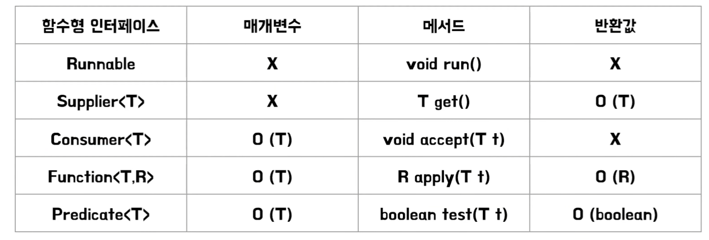

# 42. 익명 클래스보다는 람다를 사용하라

### 람다

람다는 간단하게 말하자면 메서드를 하나의 식으로 표현한 식이다. 자바에서 함수형 문법을 지원하기 위해 등장했다.

익명 클래스에서 메서드를 직접 정의해야하는 것과 다르게

```java
// 익명 클래스를 사용하는 방식
IntBinaryOperator test2 = new IntBinaryOperator() {
    @Override
    public int applyAsInt(int a, int b) {
        return a + b;
    }
};
test2.applyAsInt(1,2);
```

람다는 아래와 메서드를 하나의 식으로 표현하는 방법이다.

```java
// 람다를 사용하는 방식
IntBinaryOperator test1 = (x, y) -> x + y;
test1.applyAsInt(1,2);
```

그렇다면 함수형 인터페이스란건 뭘까?

딱 하나의 추상 메소드가 선언된 인터페이스를 말한다. (default와 static 메서드가 있어도 된다)

```java
@FunctionalInterface
public interface IntBinaryOperator {

    /**
     * Applies this operator to the given operands.
     *
     * @param left the first operand
     * @param right the second operand
     * @return the operator result
     */
    int applyAsInt(int left, int right);
}
```

그러니까 람다식은 함수형 인터페이스를 구현한 인스턴스라고 보면 된다.

람다식을 쓰려면 기본적으로 함수형 인터페이스를 따로 만들어 주어야하는데 그러기엔 귀찮으니.. 기본적으로 자바에서 제공하는 **표준 함수형 인터페이스**를 활용하면 된다.



표준 함수형 인터페이스를 활용하면 디폴트 메서드를 제공하기 때문에 다른 코드와 상호운용성이 좋아진다!

Predicate의 경우 test를 구현하기만하면 and(),or(),negate()으로 조건을 조합해 하나의 새로운 Predicate로 결합해서 사용 가능하다.

```java
// 예시
@Test
public void test() {
    Predicate<Integer> predicate1 = (num) -> num < 10;
    Predicate<Integer> predicate2 = (num) -> num > 5;

    assertThat(predicate1.or(predicate2).test(3)).isTrue();	// predicate1만 충족
    assertThat(predicate1.or(predicate2).test(12)).isTrue();	// predicate2만 충족
}
```


### 람다쓰면 좋은점

익명클래스와 비교하면 람다는 정말 간결하다.

우선 람다는 s1,s2에 대한 타입을 명시해주지 않았음을 알 수 있다.

```java
// 익명 클래스를 통해 compare를 구현할때
Collections.sort(words, new Comparator<String>() {
    public int compare(String s1, String s2) {
        return Integer.compare(s1.length(), s2.length());
    }
});
```

컴파일러가 문맥을 통해 타입을 추론한 것이다. 타입을 명시해야 코드가 더 명확할때를 제외하면 람다의 모든 매개변수 타입은 생략해야 코드가 더 간단해진다. 

하지만 제네릭때도 말했듯이 Raw타입을 활용하면 에러가 날 수 있으니 주의해야한다.

```java

// 컴파일러가 직접 타입 추론
Collections.sort(words, (s1, s2) -> Integer.compare(s1.length(), s2.length()));

// 타입 명시하는 케이스
Collections.sort(words, (String s1, String  s2) -> Integer.compare(s1.length(), s2.length()));
```

enum 또한 람다를 활용할 수 있다.

예를 들어 기존에는 추상 메서드를 선언하고, 해당 메서드를 구현하는 구조였다면

```java
enum Operation {
    PLUS("+") {
        @Override
        public double apply(double x, double y) {
            return x + y;
        }
    },
    ...

    private final String symbol;

    Operation(String symbol) {
        this.symbol = symbol;
    }

    @Override
    public String toString() {
        return symbol;
    }

    public abstract  double apply(double x, double y);
}
```

apply라는 추상 메서드를 가지고있는 BinaryOperator 함수형 인터페이스를 통해 코드 개선이 가능하다.

```java
enum Operation {
    PLUS("+", (x, y) -> x + y),
    MINUS("-", (x, y) -> x - y),
    TIMES("*", (x, y) -> x * y),
    DIVIDE("/", (x, y) -> x / y);

    private final String symbol;
    private final BinaryOperator<Double> op;

    Operation(String symbol, BinaryOperator<Double> op) {
        this.symbol = symbol;
        this.op = op;
    }

    @Override
    public String toString() {
        return symbol;
    }

    public double apply(double x, double y) {
        return op.apply(x, y);
    }
}
```

### 람다 주의점

- 문서화할 수 없다. 코드 줄 수가 많아져서 동작이 명확히 설명 안될땐 람다 쓰지말자. 가독성 나쁘다.
- 디버깅이 까다롭다. 이전 설명했던 열거타입만 해도 생성자 안의 람다는 타입 추론을 컴파일 타임에 한다. 그렇기에 람다는 열거 타입의 인스턴스 멤버에 접근할 수 없기 때문이다.

```java
// 열거 타입의 람다 예시: 열거 타입 인스턴스 멤버에 접근이 불가능
public enum Operation {
    PLUS("+", (a, b) -> a + b),
    MINUS("-", (a, b) -> a - b);

    private final String symbol;
    private final BinaryOperator<Integer> operation;

    Operation(String symbol, BinaryOperator<Integer> operation) {
        this.symbol = symbol;
        this.operation = operation;
    }

    public int apply(int a, int b) {
        return operation.apply(a, b);
    }

    // 람다에서는 this를 사용할 수 없기 때문에
    // operation에서 열거 타입 인스턴스 멤버를 참조할 수 없음
}
```

- 람다에서의 this 키워드는 바깥 인스턴스를 가리킨다. (자신을 참조할 수 없다.) 그래서 함수 객체가 자신을 참조해야한다면 익명클래스를 써야한다.

```java
// 람다에서의 this는 바깥 인스턴스를 참조
class Example {
    Runnable getRunnable() {
        return () -> {
            System.out.println(this); // this는 Example 인스턴스를 참조
        };
    }
}

// 익명 클래스에서의 this
class Example {
    Runnable getRunnable() {
        return new Runnable() {
            @Override
            public void run() {
                System.out.println(this); // this는 익명 클래스 인스턴스를 참조
            }
        };
    }
}
```

- 람다는 가상머신별로 직렬화 형태가 다를 수 있으니 직렬화하지 않도록 주의하자.

### 결론

- 익명 클래스는 함수형 인터페이스가 아닌 타입의 인스턴스를 만들때만 사용하자!

---

- [https://inpa.tistory.com/entry/☕-Lambda-Expression](https://inpa.tistory.com/entry/%E2%98%95-Lambda-Expression)
- [https://nicednjsdud.github.io/java/java-java-language-람다와-스트림/](https://nicednjsdud.github.io/java/java-java-language-%EB%9E%8C%EB%8B%A4%EC%99%80-%EC%8A%A4%ED%8A%B8%EB%A6%BC/)

키워드

- 전략패턴