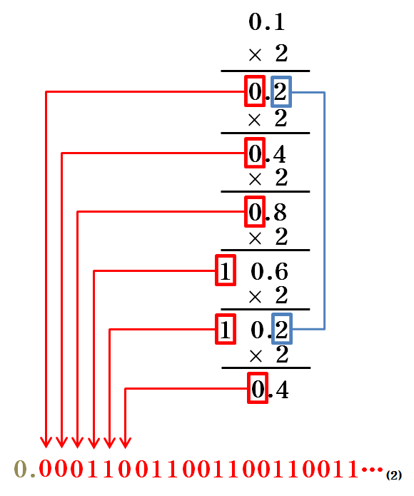

# item 60. 정확한 답이 필요하다면 float 과 double 은 피하라

### **정수가 아닌 실수(소수점)를 2진수로 표현하는 법**

1. **소수를 2진수로 표현할 때의 한계**
    - 실수를 2진수로 표현하면, 10진수에서는 유한소수인 수가 **2진수에서는 무한소수**가 될 수 있다.
    
    
    
    - 10진수에서 유한소수로 표현되는 수는, 분모가 2와 5의 조합으로만 이루어진 분수다.예를 들어:
        - 0.25는 2진수로 정확히 표현 가능: 0.25=41​=0.012​
            
            0.25=14=0.0120.25 = \frac{1}{4} = 0.01_2
            
        - 하지만 0.1은 2진수로 무한소수가 됨: 0.1=101​=0.0001100110011...(2)
            
            0.1=110=0.0001100110011...(2)0.1 = \frac{1}{10} = 0.0001100110011...(2)
            
    - **결론**: 10진수의 소수 중 대부분은 2진수로 **정확히 표현할 수 없다.**

---

### **실수를 컴퓨터 메모리로 표현하는 방법**

1. **고정 소수점 방식 (Fixed-point representation)**
    - 소수부의 자릿수를 고정하여 소수를 표현.
    - 직관적이고 간단하지만:
        - 표현할 수 있는 숫자 범위가 제한됨.
        - 자릿수를 고정하기 때문에 **공간 낭비**가 발생.


---

1. **부동 소수점 방식 (Floating-point representation)**
    - 더 넓은 숫자 범위를 표현하기 위해, 숫자를 **기수부(mantissa)**와 **지수부(exponent)**로 나눈다.
    
    
    
    - IEEE 754 표준에 따라, 부동 소수점 수는 다음과 같이 저장됨:
        - 1비트: 부호(sign)
        - 8비트: 지수(exponent) = 소수점의 위치를 가리키는 제곱승이 들어감
        - 23비트: 기수부(fraction) = 실제 실수 데이터 비트들(숫자)
    - 예를 들어, 10진수 **-118.625**를 부동 소수점으로 표현하는 과정:
        
        ```
        # 1. 음수라서 최상위 비트 1로 설정
        
        # 2. 절대값 118.625를 이진법으로 변환
        
        # 정수부 변환
        118
        = 1110110(2)
        
        # 소수부 변환
        0.625
        = 0.625 x 2 = 1.250 → 정수부 1
        = 0.250 x 2 = 0.500 → 정수부 0
        = 0.500 x 2 = 1.000 → 정수부 1
        = 101(2)
        
        # 결과
        118.625 
        = 1110110.101(2)
        
        # 3. 소수점을 이동시켜 정수부가 한자리가 되도록함(정규화)
        1110110.101 → 1.110110101 x 2^6
        
        이때 1.110110101 = 정규화된 기수, 6 = 지수
        
        # 4. 지수 계산
        
        6 + 127(편향 지수) = 133 -> 그냥 127을 더해야한다고 외우기
        
        # 5. 가수 계산
        
        부호(Sign): 1
        지수(Exponent): 10000101
        가수(Mantissa): 11011010100000000000000
        
        # 6. 최종 지수
        1 10000101 11011010100000000000000
        ```
        
        
        

여튼 이러한 부동소수점 방식도 무한대를 저장할순 없으니 메모리 한계까지 소수점을 넣다가 어느 부분에서 반올림하기때문에 무한 소수를 해결할 수 없는건 똑같다.

**그리고 이러한 미세한 값이 위치나 금융 계산에선 치명적인 실수가 될수도 있다!**

---

## **부동 소수점 방식의 한계를 극복하는 방법**

1. **정수형 타입으로 치환**
    - 실수를 정수형으로 변환하여 계산.
    - 예를 들어, 금액을 센트(1/100 달러) 단위로 표현하면 정확한 계산이 가능하다.
    - 단점: 수동으로 변환 및 나누기 처리가 필요.

```java
public class IntegerCalculation {
    public static void main(String[] args) {
        int amountInCents = 12345; // 123.45달러
        int total = amountInCents * 2; // 곱셈
        System.out.println("Total in dollars: " + (total / 100.0)); // 246.90 출력
    }
}
```

---

1. **`BigDecimal` 클래스 사용**
    - 고정 소수점과 유사하지만, 정확한 계산을 제공.
    - 금융 애플리케이션 등, **정확성이 중요한 경우**에 사용.
    - 단점: 성능이 상대적으로 느리다. = 사실상 문자열 처리라서.. (내부로직은 char로 수를 받아 소숫점의 위치와 숫자를 분리해 계산하도록 동작함)

```java
public class BigDecimalExample {
    public static void main(String[] args) {
        BigDecimal value1 = new BigDecimal("0.1");
        BigDecimal value2 = new BigDecimal("0.2");
        BigDecimal result = value1.add(value2);
        System.out.println("Expected: 0.3");
        System.out.println("Actual: " + result); // 0.3 출력
    }
}
```

---

### **결론**

1. **float**과 **double**은 실수를 근사값으로 표현하므로, **정확한 답이 필요한 계산에 적합하지 않다.**
2. 정확도가 중요하다면:
    - **정수형 타입으로 변환**하거나,
    - `BigDecimal`을 사용하라.